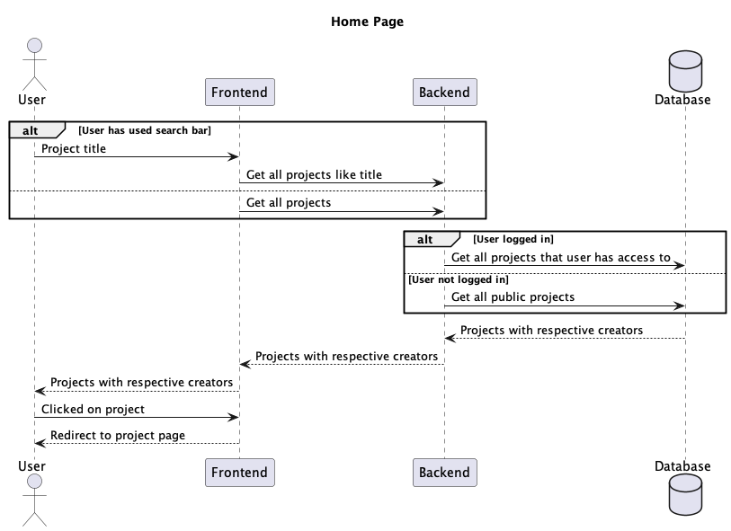
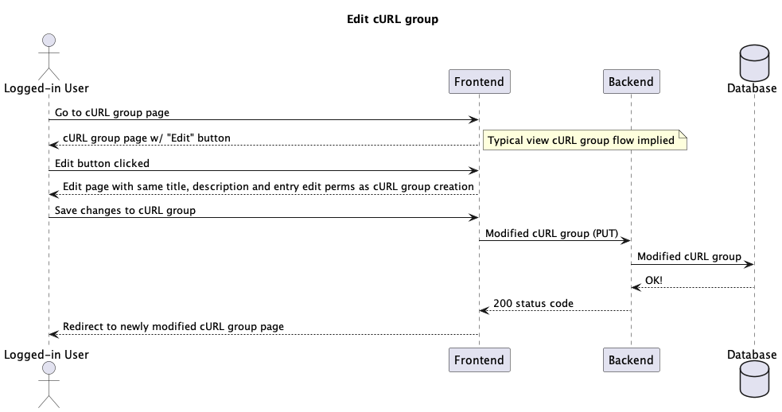

# Epics & user stories

## Enable a user to sign up, log in and log out

- As a user, I should be able to sign up to cURL Share with a username and password so that I am able to access private projects, and contribute to public projects.
- As a user, I should not be able to sign up with a non-unique username so that users can be distinct
- As a user, I should not be able to sign up with an insufficient password (minimum specification of 8 characters and at least 1 capital letter), so that fraudulent logins are less likely
- As a user, once signed up or logged in I should be redirected to the page I was last viewing so that I can pick up where I left off.
- As a logged-in user, I am able to log out at any point.

## Enable a user to manage a project

- As a logged in user, I should be able to create a project with a title, a visibility level of public or private and be appointed automatically as a project administrator.
- As a logged in user, I should not be able to create a project with a non-unique title.
- As a person who has just created a project, I should be automatically redirected to the project I have just created.
- As a project administrator, I should be able to appoint fellow project administrators who are able to change the title and visibility of a project.
- As a project administrator of a private project, I should be able to invite "allowed users" to a project by specifying their username so that users are able to view and contribute to a private project.
- As a project administrator, I should be able to delete a project.
- As a project administrator, I should be able to manage "project environments" so that a cURL request within a cURL group can be copied with the desired environment already as part of the URL.

## Enable a user to view projects on the home page

- As a non-logged in user, I should be able to view all of the public projects on cURL Share as a list so that I can browse for the project I am looking for.
- As a logged in user, I should be able to view all of the public projects on cURL Share as well as any private projects I have been given access to.
- As a user, I should be able to search for any project that I have access to.
- As a user, I should be redirected to the project page when I click on the title of a project.

## Enable a user to view a list of cURL groups on a project page

- As a user who doesn't have access to the project, I should be shown a message explaining that I have insufficient permissions to view a project page so that a project's visibility is respected.
- As a permitted user, I should be able to see the project title along with all of the cURL groups associated with that project.
- As a permitted user, I should be able to search for cURL groups within a project as well as filter by project label so that I can find what I am looking for easier.

## Allow a logged-in user to create cURL groups for a project

- As a logged-in user, I should be able to see a "New cURL Group" button and be redirected to a group creation page so that I am able to create the new cURL group.
- As a user creating a cURL group, I should be able give the new cURL group a title, description and up to 3 labels so that a group is well defined and easily searchable for future users.
- As a user creating a cURL group, I should be able add to the cURL group by pasting in a raw cURL query and adding a description.
- As a user creating a cURL group, if I paste in a cURL query with an Authorization header, I should recieve a prompt asking me if I want to redact the Authorization header's contents so that sensitive secrets are not shared.
- As a user creating a cURL group, I should be able to rearrange each entry within the cURL group to give the cURL group a specific order.
- As a user creating a cURL group, I should be given a prompt by the browser if I attempt to close the tab or go to a different page to ensure that work isn't easily lost.
- As a user creating a cURL group, I should be able to save the new cURL group and have it be immediately visible from the project page.

## Allow a logged-in user to edit a cURL group

- As a logged-in user, I want to be able to edit a cURL group, having the same tools and permissions as if I were creating the cURL group.

## Allow a permitted user to view a cURL group

- As a non-permitted user, I should be shown a message explaining that I have insufficient permissions to view a project page so that a project's visibility is respected.
- As a permitted user, I should be able to view the title, description and entries of a cURL group.
- As a permitted user, I should be able to change the environment for the cURL queries so that I am able to instantly make requests.
- As a permitted user, for each entry I should be able to see a copyable raw cURL query as well as a "pretty" breakdown of the cURL request including the URL, headers and body so that each entry is immediately understandable.

Sources used:

- https://www.christianstrunk.com/blog/user-stories-and-epics-for-the-win
